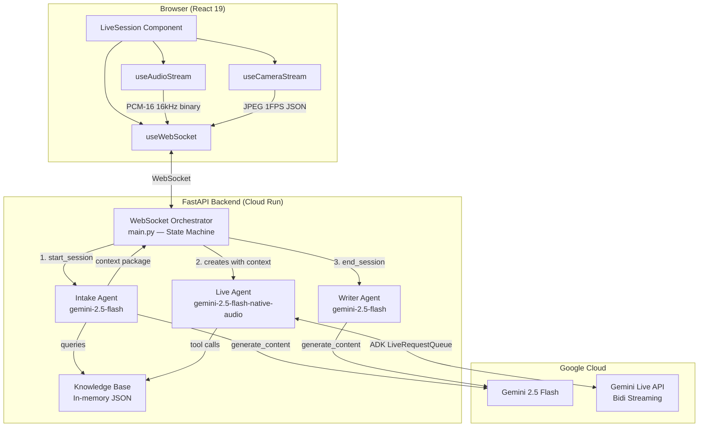
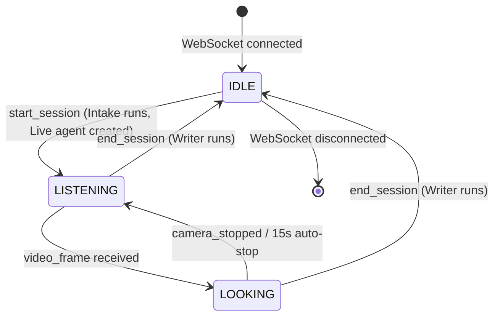
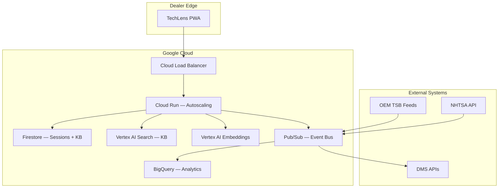

# TechLens Architecture

**Real-time multimodal AI diagnostic copilot for automotive service technicians.**

Built by Adair Labs. March 2026.

---

## 1. System Architecture

### High-Level Component Diagram



### Data Flow: Session Lifecycle

```
1. SETUP       Tech enters vehicle info + customer concern
                    |
2. INTAKE      Intake agent queries KB (TSBs, known issues, NHTSA complaints)
               Gemini Flash synthesizes analysis + diagnostic flow
               Result: ~2KB context package
                    |
3. LIVE        Live agent created with context baked into system instruction
               Bidi audio streaming begins via ADK LiveRequestQueue
               Tech talks, shows components via camera
               Agent references TSBs, guides diagnosis, logs findings
                    |
4. WRITER      Session ends. Transcript + findings + intake context
               sent to Writer agent. Gemini Flash generates three documents:
               Tech Notes, Customer Summary, Escalation Brief
                    |
5. REVIEW      Frontend displays all three documents for review/export
```

### Why Three Agents, Not One

| Concern | Single Agent | Three Agents |
|---|---|---|
| **Cost** | Live API bills every second of connection. Running intake analysis and document generation through the Live API wastes streaming tokens on non-real-time work. | Intake and Writer use standard `generate_content` (Flash pricing). Live API is only active during the diagnostic conversation. |
| **Failure isolation** | If document generation fails mid-stream, the entire session is compromised. | Each agent has independent fallback paths. Intake failure degrades to basic vehicle info. Writer failure generates template documents. Live agent errors are caught without losing the transcript. |
| **Model selection** | Locked to one model. | Intake and Writer use Flash for speed and cost. Live agent uses native-audio model for real-time voice quality. Each agent uses the optimal model for its task. |
| **Context window** | System instruction grows unbounded as you add KB data, transcript, and output formatting rules. | Intake compresses 70KB KB down to ~2KB relevant context. Live agent gets a focused system instruction. Writer gets structured input, not a sprawling conversation history. |

---

## 2. Agent Design Patterns

### Dynamic System Instruction Injection

The core architectural insight: the Live agent's system instruction is not static. It is constructed at runtime from the Intake agent's output.

```
┌─────────────────────────────────────────────────────┐
│  BASE_INSTRUCTION (static template)                 │
│  "You are TechLens, an expert automotive..."        │
│                                                     │
│  {intake_context}  <── injected at session start    │
│    VEHICLE: 2023 Subaru Outback                     │
│    CUSTOMER CONCERN: Shudder at low speed           │
│    RELEVANT TSBs: TSB-02-123: CVT recalibration...  │
│    KNOWN ISSUES: CVT shudder (severity: high)...    │
│    SUGGESTED DIAGNOSTIC FLOW:                       │
│      1. Reproduce the shudder below 25 MPH          │
│      2. Check CVT fluid level and condition          │
│      ...                                            │
└─────────────────────────────────────────────────────┘
```

This means the Live agent starts the conversation already knowing:
- What vehicle is on the lift
- What the customer complained about
- Which TSBs apply
- What diagnostic steps to follow
- What patterns other owners have reported

The tech never has to brief the AI. It is already briefed.

### Tool Design

Two tools, deliberately minimal:

**`search_knowledge_base(query, vehicle_id)`** -- The Live agent's escape hatch. When the conversation goes beyond the pre-loaded context (tech asks about a different system, discovers an unrelated issue), the agent searches the full KB on demand. Scoped by `vehicle_id` to avoid cross-vehicle noise.

**`log_finding(description, component, severity)`** -- Structured data capture during conversation. When the tech confirms something ("yep, the CV boot is torn"), the agent logs it with component and severity. These findings flow directly into the Writer agent's input, ensuring nothing discussed verbally gets lost in documentation.

Why not more tools? In a real-time voice conversation, every tool call creates latency. The user hears silence while the tool executes. Two tools is the right trade-off: enough capability to be useful, few enough that the agent does not over-tool and create dead air.

### Fallback-First Design

Every agent has a fallback path when Gemini is unavailable:

- **Intake**: Returns raw vehicle info + customer concern without analysis. The Live agent still functions, it just starts with less context.
- **Live**: Stream errors are caught and surfaced to the frontend. The transcript and any logged findings are preserved regardless.
- **Writer**: `_fallback_outputs()` generates template-based documents from the transcript and findings. The tech always gets documentation, even if the Gemini call fails.

This is a design constraint from the deployment target: a real shop cannot have a tool that sometimes produces nothing. Degraded output is always better than no output.

### Context Compression

The knowledge base is approximately 70KB of JSON (3 vehicles, 8 TSBs, 175 NHTSA complaints, 14 known issues). The Live agent's context window cannot absorb all of this, and most of it is irrelevant to any single diagnostic session.

```
70KB full KB
  → Intake agent filters by year/make/model + keyword matching
  → Top 5 TSBs, relevant known issues, complaint patterns
  → Gemini Flash synthesizes analysis + diagnostic flow
  → ~2KB context package injected into Live agent instruction
```

Compression ratio: roughly 35:1. This is not just about token cost. A focused system instruction produces better responses. The agent does not hallucinate connections between unrelated TSBs because those TSBs are not in its context.

---

## 3. Real-Time Streaming Architecture

### WebSocket Orchestrator Pattern

`main.py` is a state machine, not a request handler. A single WebSocket connection persists for the entire session, and the orchestrator routes messages based on type and current phase.



Key implementation detail: the orchestrator uses `asyncio.create_task` to run the Live agent's event stream (`run_live_downstream`) concurrently with the WebSocket message loop. This allows bidirectional flow: the tech sends audio/video upstream while the agent sends transcriptions, audio, and tool calls downstream -- simultaneously.

### ADK LiveRequestQueue Integration

The Google ADK's `LiveRequestQueue` is the bridge between the WebSocket and Gemini's Live API. Three input methods map to three data types:

| Method | Data Type | Use Case |
|---|---|---|
| `send_realtime(blob)` | `types.Blob` | Audio chunks (PCM-16) and video frames (JPEG) |
| `send_content(content)` | `types.Content` | Text messages from the tech |
| `close()` | Signal | End the streaming session |

The `RunConfig` specifies bidirectional streaming (`StreamingMode.BIDI`), audio response modality, and transcription for both input and output audio. This gives us text transcripts of the voice conversation without running a separate ASR pipeline.

### Audio Pipeline

```
Browser Microphone
  → getUserMedia({ sampleRate: 16000, channelCount: 1 })
  → ScriptProcessor captures Float32 chunks every 4096 samples
  → float32ToInt16() conversion (PCM-16 encoding)
  → Buffer flushed every 250ms as raw ArrayBuffer
  → WebSocket binary frame
  → main.py: types.Blob(mime_type="audio/pcm;rate=16000", data=bytes)
  → LiveRequestQueue.send_realtime()
  → Gemini Live API

Gemini Live API
  → ADK event with inline_data (audio/pcm at 24kHz)
  → WebSocket JSON frame (base64-encoded PCM)
  → Browser: atob → Int16Array → Float32Array (/ 32768)
  → AudioContext.createBuffer(1, length, 24000)
  → BufferSource → speakers
```

Note the sample rate asymmetry: 16kHz input, 24kHz output. This is a Gemini Live API constraint. The frontend handles both natively.

### Video Pipeline

```
Browser Camera
  → getUserMedia({ facingMode: 'environment', 1280x720 })
  → Canvas drawImage at 1 FPS interval
  → canvas.toDataURL('image/jpeg', 0.7)
  → Base64 string sent as JSON { type: 'video_frame', data: b64 }
  → main.py: types.Blob(mime_type="image/jpeg", data=bytes)
  → LiveRequestQueue.send_realtime()
  → Gemini Live API (multimodal context)
```

Design choices:
- **1 FPS**: Diagnostic scenes are mostly static. A part on a bench, a component under hood. 1 FPS is sufficient and keeps bandwidth manageable.
- **70% JPEG quality**: Enough detail for component identification. Gemini's vision model handles compression artifacts well.
- **`facingMode: 'environment'`**: The tech points the phone at the car, not at themselves.
- **15-second auto-stop**: Camera sessions are intentionally short. "Look at this" is a 5-10 second interaction. Auto-stop prevents forgotten streams from consuming bandwidth and tokens.

### Three-State Model

```
IDLE      → Zero token consumption. WebSocket alive for control messages only.
LISTENING → Audio-only streaming. The default diagnostic state.
LOOKING   → Audio + video streaming. Triggered by first video frame.
            Auto-reverts to LISTENING when camera stops.
```

The phase transition from LISTENING to LOOKING happens automatically when the first `video_frame` message arrives. No explicit "start camera session" command needed. The tech just opens the camera and the system adapts. This is important for hands-free operation: a tech with greasy hands should not need to tap extra buttons.

---

## 4. Knowledge Base Architecture

### Schema Design

```json
{
  "vehicles": [{
    "id": "subaru_outback_2023",
    "year": 2023, "make": "Subaru", "model": "Outback",
    "engines": [{"type": "2.5L BOXER 4-cyl", "code": "FB25D"}],
    "transmission": {"type": "Lineartronic CVT", "code": "TR580"},
    "safety_systems": ["EyeSight 4.0", "Subaru STARLINK"],
    "known_issues_from_field": [{
      "issue": "CVT shudder at low speed",
      "severity": "high",
      "symptoms": ["..."],
      "common_fix": "CVT valve body replacement or fluid change"
    }],
    "nhtsa_complaints": {
      "total_complaints": 58,
      "top_issues": [{
        "category": "POWER TRAIN:AUTOMATIC TRANSMISSION",
        "count": 12,
        "examples": [{"summary": "...", "date": "2024-01-15"}]
      }]
    }
  }],
  "tsbs": [{
    "number": "TSB-16-129-18R",
    "title": "CVT Fluid Contamination",
    "affected_vehicles": [{"make": "Subaru", "models": ["Outback"], "years": [2021,2022,2023]}],
    "symptom": "Shudder, hesitation during acceleration",
    "fix": "Replace CVT fluid with updated specification"
  }]
}
```

The schema encodes relationships the way a service advisor thinks: vehicle to its known issues, TSBs to affected vehicles, complaints grouped by NHTSA category. This is not a generic document store. It is a domain-specific diagnostic reference.

### In-Memory Loading

The KB loads once at import time via module-level execution. This is a deliberate choice:

- **Cold start**: One JSON parse on container boot. No database roundtrips during session startup.
- **Search latency**: In-memory iteration over 3 vehicles and 8 TSBs is sub-millisecond. No index needed at this scale.
- **Simplicity**: No ORM, no connection pool, no cache invalidation. The KB is read-only during runtime.

### Fuzzy Matching

TSB matching handles two `affected_vehicles` formats:
1. **String**: `"2021-2023 Outback"` -- parsed with year range extraction
2. **Dict**: `{"make": "Subaru", "models": ["Outback"], "years": [2021, 2022, 2023]}` -- direct field matching

Keyword matching serializes the entire TSB to JSON and checks for substring presence. This is intentionally crude. At 8 TSBs, precision is less important than recall. A false positive TSB in the context is far less costly than a missed one.

### Scaling Path

| Scale | Strategy |
|---|---|
| **Current (3 vehicles, 8 TSBs)** | In-memory JSON. Sub-millisecond search. |
| **100 vehicles, 200 TSBs** | Still viable in-memory. JSON grows to ~2MB. Load time under 100ms. |
| **1,000 vehicles, 5,000 TSBs** | Move to Firestore with composite indexes on make/model/year. Vector embeddings for semantic TSB search. KB becomes a service, not a module. |
| **OEM-scale (all vehicles, all TSBs)** | Dedicated search infrastructure. Elasticsearch or Vertex AI Search. Per-OEM data partitioning. Real-time TSB feed ingestion. |

---

## 5. Frontend Architecture

### Phase State Machine

The top-level `App.jsx` manages three phases:

```
SETUP  →  ACTIVE  →  REVIEW
  │          │          │
  │          │          └── SessionOutputs: display tech notes,
  │          │              customer summary, escalation brief
  │          └── LiveSession: real-time diagnostic conversation
  └── SessionStart: vehicle info + customer concern form
```

Each phase is a clean boundary. The SETUP phase collects structured data. The ACTIVE phase is a full-screen diagnostic workspace. The REVIEW phase presents generated documents. No state bleeds between phases.

### Custom Hooks

**`useWebSocket(userId, sessionId)`**
- Auto-connects on mount. Auto-reconnects up to 5 times with 2-second delay.
- Exposes `sendMessage` (JSON text frames) and `sendBinary` (raw ArrayBuffer).
- `lastEvent` state triggers re-renders on every incoming message. The component decides what to do with each event.
- `mountedRef` guard prevents state updates after unmount.

**`useAudioStream({ onBinary })`**
- Captures mono audio at 16kHz via `getUserMedia`.
- `ScriptProcessor` accumulates Float32 samples into a buffer.
- Every 250ms, the buffer is flushed: Float32 to Int16 conversion, then sent as raw `ArrayBuffer` via the `onBinary` callback.
- RMS-based audio level calculation for the UI meter.
- Prefers binary WebSocket frames (`onBinary`) over base64 JSON (`onChunk`) to reduce encoding overhead by ~33%.

**`useCameraStream({ onFrame, fps })`**
- Captures rear camera at 1280x720. Uses `facingMode: 'environment'` for diagnostic use.
- Offscreen `<video>` and `<canvas>` elements for frame capture without DOM rendering overhead.
- Every 1000ms (1 FPS), draws video frame to canvas, exports as JPEG at 70% quality, sends base64 via `onFrame` callback.
- Exposes the raw `MediaStream` so `CameraFeed` component can display a live preview.

### ADK Event Parsing

The `parseAdkEvent` function handles a messy reality: ADK serializes events with Protobuf-style aliases, so the same field can arrive as either `camelCase` or `snake_case` depending on the serialization path.

```javascript
const inputTranscription = event.inputTranscription || event.input_transcription
const inlineData = part.inlineData || part.inline_data
const fnCall = part.functionCall || part.function_call
```

This dual-format handling is not optional. ADK's `model_dump_json(by_alias=True)` produces camelCase, but some code paths use snake_case. The parser normalizes both into a flat array of typed items (`transcript`, `audio`, `tool_call`, `tool_result`, `turn_complete`) that the component can process uniformly.

Streaming transcriptions are accumulated in `pendingRef` until a `turn_complete` signal flushes them as complete messages. This prevents partial transcriptions from creating a stuttering UI.

---

## 6. Competitive Moat and IP Opportunities

### Data Moat

**Proprietary KB per dealer/OEM.** The knowledge base is not just public TSBs. It encodes field experience: which issues actually appear in the shop, which fixes actually work, severity ratings based on real repair outcomes. Every dealer's KB diverges over time based on their vehicle mix and regional conditions. This data does not exist in any public dataset.

**Session-generated training data.** Every diagnostic session produces a labeled dataset: vehicle + symptoms + diagnostic steps + confirmed findings + resolution. Aggregated across thousands of sessions, this becomes a diagnostic pattern database that no competitor can replicate without equivalent deployment scale.

**Competitive intelligence.** Aggregated, anonymized diagnostic patterns reveal: which components fail most by model year, which TSB fixes are effective, which issues are under-reported to NHTSA. This data is valuable to OEMs, parts suppliers, and warranty administrators.

### Workflow Lock-In

**DMS integration.** The auto repair industry runs on Dealer Management Systems (CDK Global, Reynolds & Reynolds, Tekion). If TechLens writes directly to the repair order in the DMS, the switching cost becomes enormous. The tech's workflow becomes: diagnose with TechLens, tap "done," and the RO is populated. Replacing TechLens means going back to manual documentation.

**Multi-audience document generation.** A single diagnostic session produces three documents for three audiences (tech, customer, manufacturer). Any replacement tool must replicate all three output formats. This is a surprisingly high bar because each format encodes different domain conventions.

### Domain Expertise Encoding

The system instruction templates, diagnostic flows, and document formats encode deep automotive service knowledge:

- How a tech actually describes symptoms vs. how a TSB describes them
- The difference between what a customer needs to hear and what a manufacturer rep needs to see
- Which diagnostic steps should come first based on likelihood, not alphabetical order
- How severity ratings map to repair urgency

This knowledge is hard to replicate without real shop experience. It is embedded in prompt engineering, tool design, and output formatting -- not in easily-copied UI code.

### Network Effects

```
More techs → more sessions → better diagnostic patterns
  → better recommendations → faster diagnoses → more techs adopt
```

At sufficient scale, TechLens becomes more accurate than any individual tech's memory. The system has seen 10,000 CVT shudder cases; the tech has seen 50. This creates a genuine network effect where the product improves with usage.

### Patent-Eligible Innovations

1. **Real-time multimodal diagnostic pipeline with context-aware vision.** Method patent: using a pre-filtered knowledge base to condition a multimodal model's interpretation of live video in a diagnostic context. The model does not just see "a metal part." It sees "a CV boot on a 2023 Outback that has TSB-16-129-18R applicable."

2. **Multi-audience documentation from a single real-time session.** The three-document output (tech notes, customer summary, escalation brief) from one voice conversation is a novel workflow. Existing tools generate one document type or require separate input for each.

3. **Dynamic system instruction injection from pre-filtered knowledge base.** The pattern of compressing a large reference corpus into a session-specific system instruction via an intermediary agent is a generalizable technique with specific automotive application.

### First-Mover Advantages

- **OEM certification.** If TechLens becomes the first AI diagnostic tool certified by a major OEM (e.g., Subaru of America approves it for dealer use), competitors need their own certification process. OEM certification is slow, relationship-dependent, and not purely technical.
- **Regulatory positioning.** As states move toward requiring digital documentation for emissions and safety inspections, the first tool with compliant output formats has a structural advantage.
- **Training data accumulation.** Every month of deployment generates data that improves the system. A competitor launching 12 months later starts with 12 months less training data.

### Expansion Vectors

| Vector | Description | Revenue Model |
|---|---|---|
| **Insurance claims** | Auto-generate claims documentation from diagnostic sessions with photo evidence | Per-claim fee or insurer SaaS |
| **Fleet management** | Predictive maintenance from aggregated diagnostic patterns across fleet vehicles | Fleet SaaS subscription |
| **Training/certification** | Recorded sessions become training material for junior techs. AI evaluates diagnostic reasoning. | Training platform subscription |
| **Warranty automation** | Auto-populate warranty claims with TSB references and diagnostic evidence | Per-claim fee to OEM |
| **Parts ordering** | When findings confirm a needed part, trigger order directly from the session | Parts supplier commission |

---

## 7. Scaling Roadmap

### Current State (Hackathon MVP)

- In-memory JSON knowledge base (3 vehicles, 8 TSBs)
- Single-session, single-user
- No persistence (session data lives in memory, lost on disconnect)
- Cloud Run single instance

### Next Phase (Post-Hackathon)

- **Firestore persistence**: Session transcripts, findings, and generated documents stored per-dealer
- **Multi-tenant**: Per-dealer KB partitioning via Firestore collections
- **User authentication**: Firebase Auth with dealer-level access control
- **KB management UI**: Dealers can add vehicles, custom notes, and shop-specific diagnostic procedures
- **Session history**: Techs can review past sessions, search by vehicle or symptom

### Growth Phase

- **OEM API integrations**: Real-time TSB feeds from OEM portals (Subaru STIS, Toyota TIS, GM GlobalConnect)
- **DMS connectors**: CDK, Reynolds & Reynolds, Tekion APIs for RO read/write
- **Semantic search**: Vector embeddings for KB search (Vertex AI Embeddings) replacing keyword matching
- **Diagnostic pattern ML**: Train models on aggregated session data to predict likely root causes before the tech even starts diagnosing
- **Multi-language**: Support for Spanish (large segment of the US tech workforce)

### Architecture at Scale



The core three-agent pattern survives at scale. The Intake agent queries Vertex AI Search instead of in-memory JSON. The Live agent is unchanged. The Writer agent writes to Firestore and optionally to DMS. The orchestrator pattern in `main.py` becomes the template for a Cloud Run service that autoscales horizontally -- each WebSocket connection is independent, so horizontal scaling is straightforward.

---

*Built by Richard Adair / Adair Labs. Architecture informed by real dealership service department experience.*
