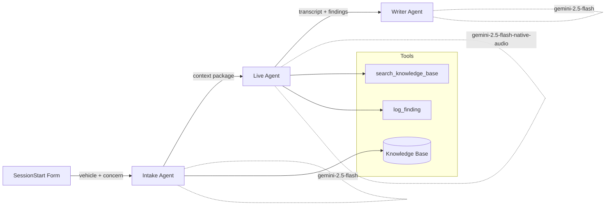
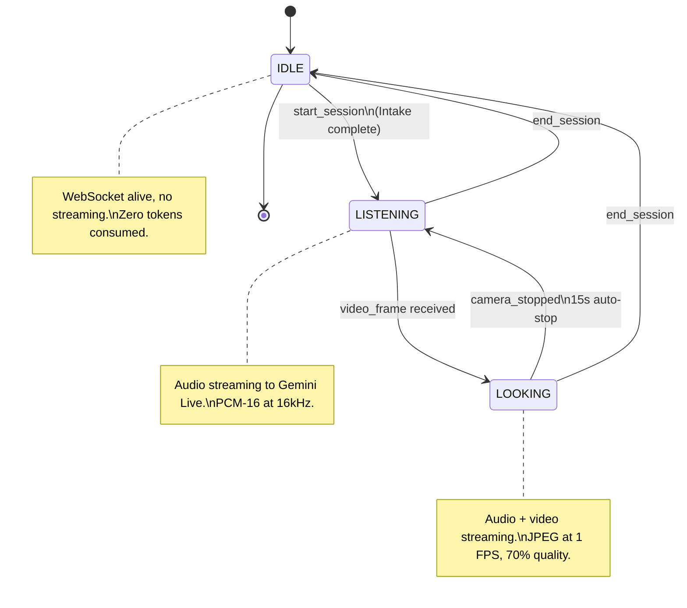
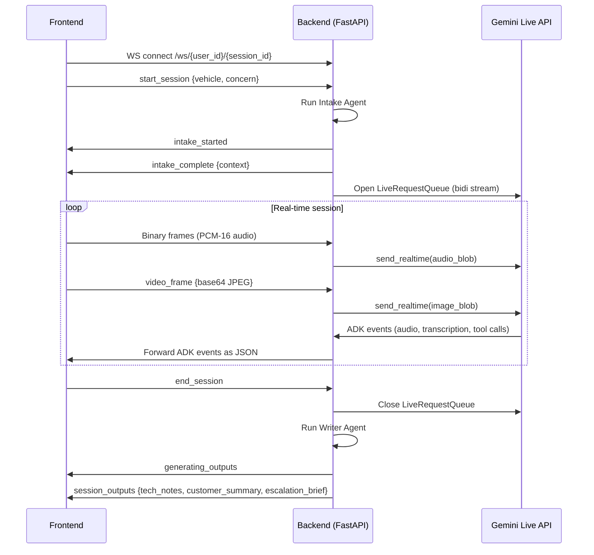
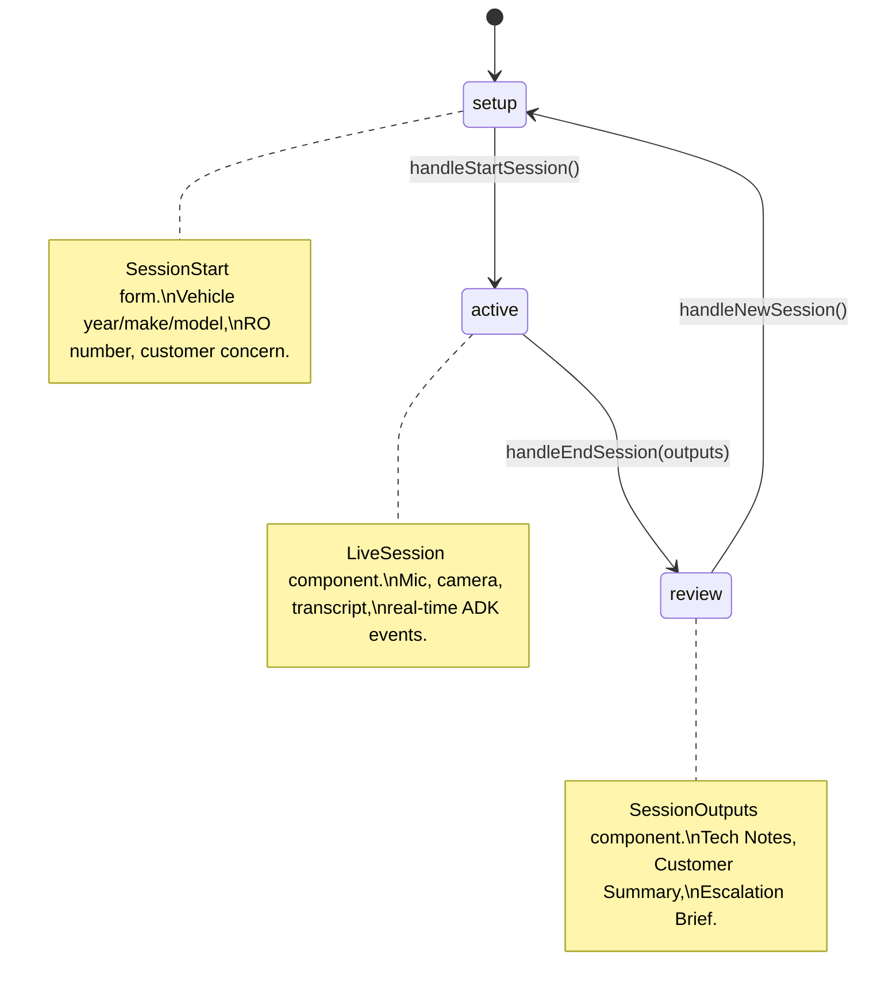

# TechLens

**A real-time voice + vision AI copilot that sits beside an auto repair technician, listens to their diagnosis, sees what the camera sees, and writes the paperwork when the job is done.**

Built for the [Gemini Live Agent Challenge](https://ai.google.dev/gemini-api/docs/live-agent-challenge) by [Adair Labs](https://adairlabs.com).

---

## How It Works

The technician enters vehicle info and the customer's concern. TechLens runs a three-agent pipeline:

1. **Intake Agent** queries the knowledge base for TSBs, known issues, and NHTSA complaint patterns, then synthesizes a diagnostic context package.
2. **Live Agent** opens a bidirectional audio/video stream via the Gemini Live API. The tech talks hands-free; TechLens responds with voice. When the tech points the phone camera at a component, TechLens sees it and offers diagnostic guidance.
3. **Writer Agent** takes the full transcript, logged findings, and intake context, then generates three documents: Tech Notes, Customer Summary, and Escalation Brief.

---

## Architecture

### Three-Agent Pipeline



### Three-State Session Model



### WebSocket Message Flow



### Frontend Phase State Machine



---

## Agent Roles

| Agent | Model | When It Runs | What It Does | Tools |
|-------|-------|-------------|-------------|-------|
| **Intake** | `gemini-2.5-flash` | Once, at session start | Queries KB for vehicle profile, TSBs, known issues, NHTSA complaints. Calls Gemini to synthesize a concern analysis and suggested diagnostic flow. Produces a context package injected into the Live agent's system instruction. | `get_vehicle_profile`, `get_matching_tsbs`, `get_known_issues` |
| **Live** | `gemini-2.5-flash-native-audio-latest` | Continuous, during session | Bidirectional audio/video streaming via ADK `run_live()`. Speaks like a senior master tech. References TSBs and known issues from context. Analyzes camera frames. Logs confirmed findings via tool call. Falls back to `search_knowledge_base` for data outside pre-loaded context. | `search_knowledge_base`, `log_finding` |
| **Writer** | `gemini-2.5-flash` | Once, after session ends | Takes transcript text, intake context, and logged findings. Generates three documents: Tech Notes (for RO file), Customer Summary (plain English), and Escalation Brief (for manufacturer rep). Includes fallback template generation if Gemini is unavailable. | None |

---

## Tech Stack

| Layer | Technology | Version |
|-------|-----------|---------|
| Backend | Python, FastAPI, Uvicorn | 3.13, >=0.115, >=0.34 |
| AI Framework | Google ADK (`google-adk`) | >=1.20 |
| AI SDK | Google GenAI (`google-genai`) | >=1.0 |
| Live Streaming | Gemini Live API via ADK `LiveRequestQueue` | Bidi streaming |
| Frontend | React, Vite | 19, 8 |
| Styling | Tailwind CSS | 4 |
| Data | In-memory JSON knowledge base | 70KB |
| Deployment | Cloud Run, Docker | Python 3.12-slim |
| Audio | PCM-16 at 16kHz (input), 24kHz (output) | WebSocket binary frames |
| Video | JPEG at 1 FPS, 70% quality, rear camera | Base64 over WebSocket |

---

## Project Structure

```
techlens/
├── backend/
│   ├── main.py                     # FastAPI WebSocket orchestrator + session state machine
│   ├── agents/
│   │   ├── intake_agent.py         # Pre-session KB query + Gemini analysis
│   │   ├── live_agent.py           # Real-time voice+vision ADK agent factory
│   │   └── writer_agent.py         # Post-session document generation
│   ├── tools/
│   │   └── knowledge_base.py       # Unified KB: load, search, filter (in-memory JSON)
│   ├── models/
│   │   └── session_state.py        # SessionPhase enum, IntakeContext, SessionTranscript
│   ├── Dockerfile                  # Python 3.12-slim, copies KB into /app/
│   ├── requirements.txt
│   └── seed_data.py                # Firestore seed script
├── frontend/
│   └── src/
│       ├── App.jsx                 # Phase state machine (setup / active / review)
│       ├── components/
│       │   ├── SessionStart.jsx    # Vehicle + concern intake form
│       │   ├── LiveSession.jsx     # Real-time session: mic, camera, transcript
│       │   ├── AudioControls.jsx   # Mic toggle, speaker toggle, audio level meter
│       │   ├── CameraFeed.jsx      # Camera preview with 15s auto-stop countdown
│       │   └── SessionOutputs.jsx  # Post-session document viewer
│       └── hooks/
│           ├── useWebSocket.js     # WebSocket with auto-reconnect (5 attempts, 2s delay)
│           ├── useAudioStream.js   # MediaDevices audio capture, PCM-16 chunking at 250ms
│           └── useCameraStream.js  # Rear camera capture, JPEG frame extraction at 1 FPS
├── test_knowledgebase/
│   ├── techlens_knowledge_base.json   # Primary KB (3 vehicles, 8 TSBs, 175+ complaints)
│   ├── complaints_outback_2023.json   # Raw NHTSA complaint data
│   ├── complaints_forester_2023.json
│   └── complaints_crosstrek_2023.json
├── deploy.sh                       # Cloud Run deployment script
├── docs/                           # Design specs and implementation plans
└── research-docs/                  # Competitive analysis, data sourcing notes
```

---

## Quick Start

### Prerequisites

- Python 3.13+
- Node.js 20+
- A Google AI Studio API key ([get one here](https://aistudio.google.com/apikey))

### Backend

```bash
cd backend
python -m venv .venv && source .venv/bin/activate
pip install -r requirements.txt
```

Create a `.env` file in `backend/`:

```
GOOGLE_API_KEY=your_api_key_here
```

Start the server:

```bash
uvicorn main:app --reload --port 8080
```

### Frontend

```bash
cd frontend
npm install
npm run dev
```

Open `http://localhost:5173`. The Vite dev server proxies `/ws` to `localhost:8080`. Use a 2023 Subaru Outback for the best knowledge base coverage.

---

## Environment Variables

| Variable | Required | Default | Description |
|----------|----------|---------|-------------|
| `GOOGLE_API_KEY` | Yes | -- | Google AI Studio API key for Gemini access |
| `GOOGLE_GENAI_USE_VERTEXAI` | No | -- | Set to `1` to use Vertex AI instead of AI Studio |
| `TECHLENS_MODEL` | No | `gemini-2.5-flash-native-audio-latest` | Model for the Live agent |
| `TECHLENS_INTAKE_MODEL` | No | `gemini-2.5-flash` | Model for the Intake agent |
| `TECHLENS_WRITER_MODEL` | No | `gemini-2.5-flash` | Model for the Writer agent |

---

## Knowledge Base

The knowledge base is a single 70KB JSON file (`test_knowledgebase/techlens_knowledge_base.json`) loaded into memory at server startup. No database required for the demo.

### Contents

- **3 vehicles:** 2023 Subaru Outback, Forester, Crosstrek
- **Per vehicle:** engine specs, transmission type, drivetrain, safety systems, known field issues
- **8 TSBs:** Technical Service Bulletins with affected vehicles, symptoms, and fixes
- **175+ NHTSA complaints:** Categorized by system (powertrain, electrical, brakes, etc.) with example summaries

### How It Works

1. **At session start**, the Intake agent calls `get_vehicle_profile()`, `get_matching_tsbs()`, and `get_known_issues()` to pull vehicle-specific data. TSBs are matched by year/make/model and optionally filtered by keywords extracted from the customer concern.

2. **During the live session**, if the technician asks about something outside the pre-loaded context, the Live agent calls `search_knowledge_base()`. This performs keyword search across all TSBs, known issues, and NHTSA complaints, optionally scoped by vehicle ID.

3. **At session end**, the Writer agent receives the full context package and references relevant TSBs in the generated documents.

---

## Deployment

### Cloud Run (Production)

```bash
./deploy.sh --project YOUR_GCP_PROJECT_ID --region us-central1
```

This script:
1. Builds the Docker image via Cloud Build
2. Deploys to Cloud Run with port 8080 and unauthenticated access
3. The Dockerfile copies both the backend source and the knowledge base into the container

Set `GOOGLE_API_KEY` as a Cloud Run environment variable or secret.

### Docker (Local)

Build from the project root (not `backend/`) because the Dockerfile copies `test_knowledgebase/` into the image:

```bash
docker build -t techlens-backend -f backend/Dockerfile .
docker run -p 8080:8080 -e GOOGLE_API_KEY=your_key techlens-backend
```

---

## Contest

**Gemini Live Agent Challenge** -- a hackathon by Google challenging developers to build real-time, multimodal AI agents using the Gemini Live API.

- **Deadline:** March 16, 2026 at 5:00 PM PDT
- **Requirements:** Gemini model + Google GenAI SDK or ADK + at least 1 GCP service + hosted on Cloud Run
- **Deliverables:** Working demo, architecture diagram, demo video (< 4 min)
- **Built by:** [Adair Labs](https://adairlabs.com)

---

## License

MIT
